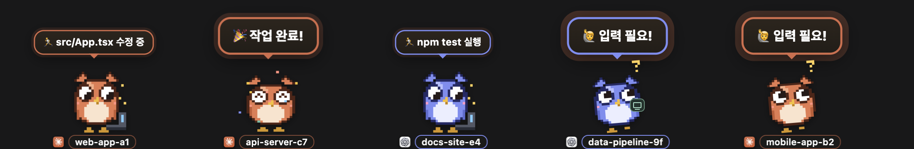
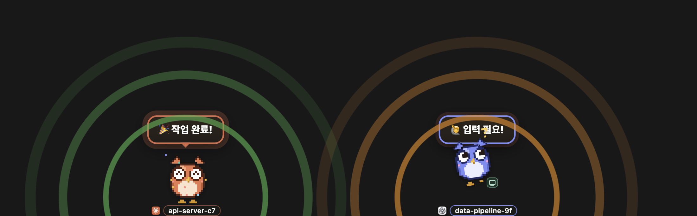
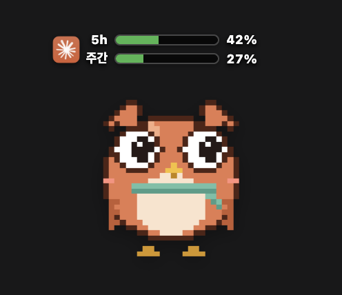
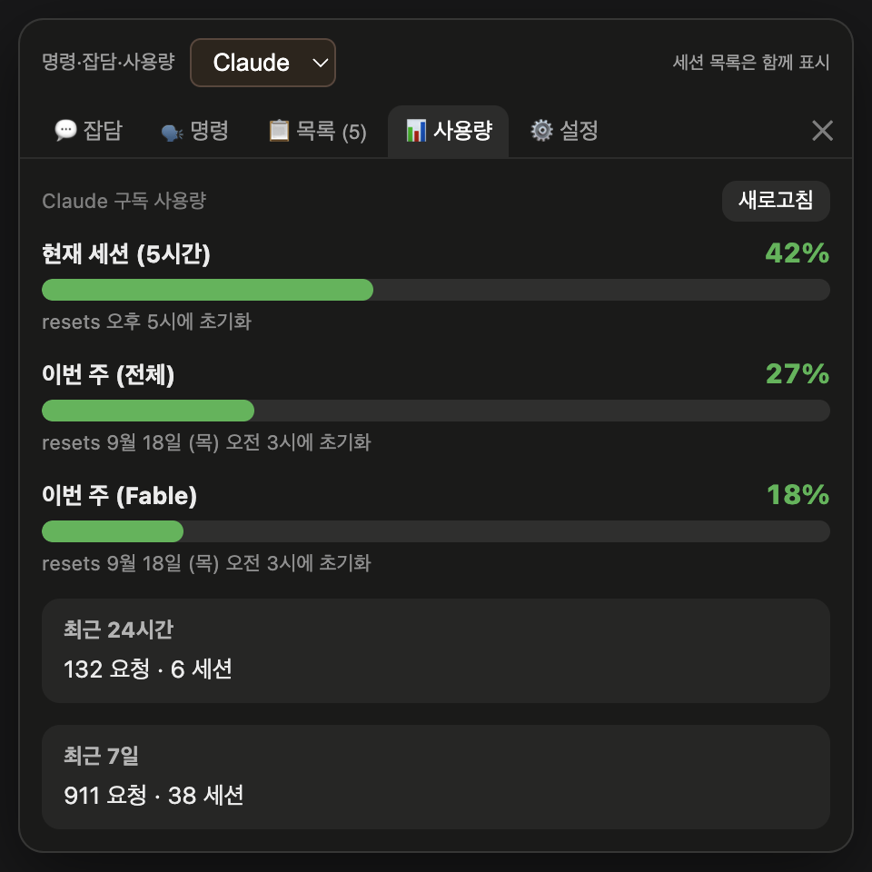
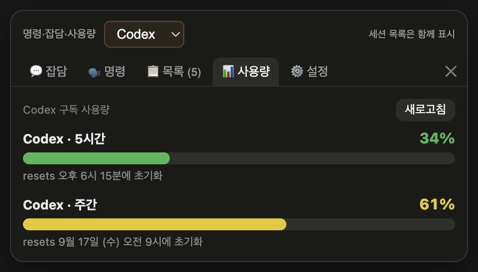
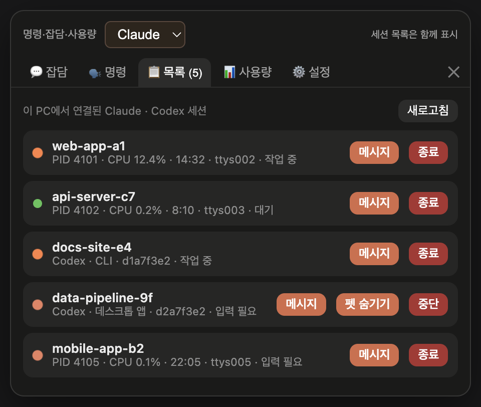
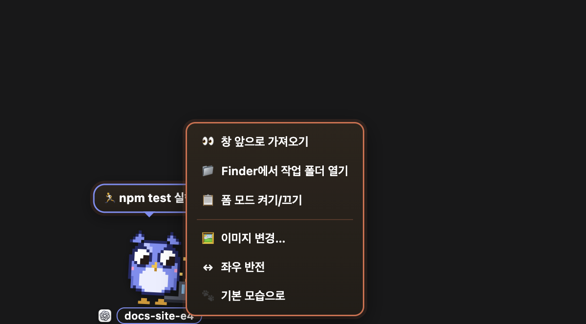
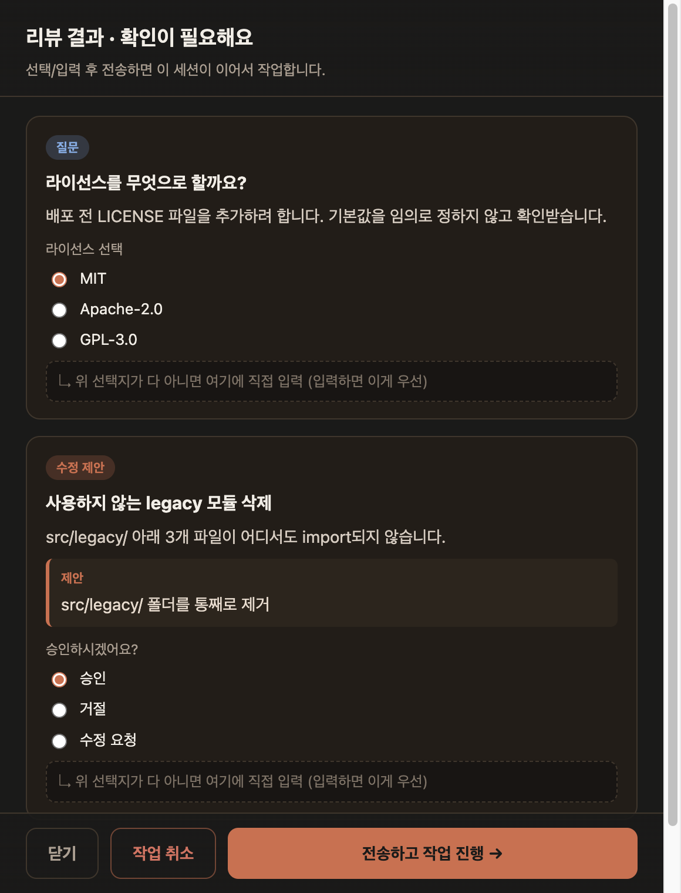
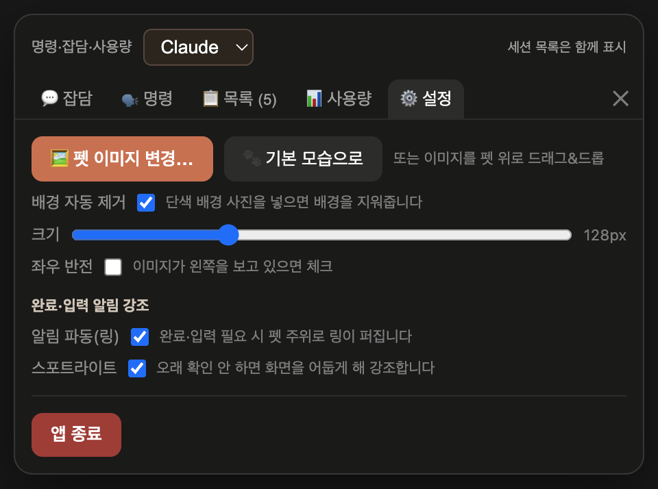

# 🐦 Claude Session Pets

실행 중인 **Claude Code · Codex 세션을 감시해, 세션마다 작은 데스크탑 펫을 띄우는** macOS 앱.
각 펫이 자기 세션의 상태(작업 중 · 입력 필요 · 완료)와 **지금 하고 있는 작업**을 말풍선으로 보여줍니다.

> Electron 기반. 화면 위를 돌아다니는 투명 오버레이라 다른 작업을 방해하지 않습니다.
> 기본 캐릭터는 **도트(픽셀) 부엉이 가족** — 메인펫은 스카프를 두른 어미 부엉이, 세션마다 뜨는 작은 펫은 아기 부엉이입니다. 정면의 아주 큰 눈이 시선·표정으로 상태를 말하고, 걸을 땐 옆모습으로 바뀝니다(둘 다 원하는 이미지로 교체 가능).



**v1.2** — 기본 캐릭터가 **도트 부엉이 가족**으로 바뀌었습니다(정면 표정 + 옆모습 걷기). **v1.1** — Claude Code에 더해 **Codex CLI · Codex 데스크톱 앱** 세션도 함께 표시합니다. 이름표 앞의 아이콘과 하늘~보라색(페리윙클) 테두리·몸색이 Codex 펫입니다. 자세한 내용은 [Codex 지원](#codex-지원) 절 참고.

---

## 한눈에 보기

### 알림 강조 — 놓치지 않게

완료·입력 필요·폼 대기 시 펫이 **점프**하고 주위로 **링 파동**이 리듬 있게 퍼집니다(완료=초록, 입력 필요=주황).
오래 확인하지 않으면 **화면 배경이 어두워져(스포트라이트)** 펫이 도드라집니다. 둘 다 ⚙️ 설정에서 켜고 끌 수 있습니다.



### 사용량 표시 — 게임 HP바처럼

메인펫 머리 위에 **2줄 HP바**(5시간 세션 / 주간)로 구독 사용량을 표시합니다. 펫을 클릭 → **📊 사용량** 탭에서 상세를 볼 수 있습니다.
패널 위쪽의 **Claude / Codex** 선택으로 어느 서비스의 사용량을 볼지 고릅니다.

<p align="center">
  
  &nbsp;&nbsp;
  
  &nbsp;&nbsp;
  
</p>

### 세션 목록 — Claude와 Codex를 한 화면에

**📋 목록** 탭에 이 PC의 Claude CLI 프로세스와 Codex 세션(CLI · 데스크톱 앱 · 공유 서버)이 함께 뜹니다.
각 행에서 **메시지 보내기**(살아있는 세션에 프롬프트 전달), **종료/중단**, 데스크톱 펫 **숨기기/표시**가 가능합니다.

<p align="center">
  
  &nbsp;&nbsp;
  
</p>

### 세션 폼 — 입력이 필요하면 펫이 폼을 띄움

세션에서 **`/session-form on`**(Claude) 또는 세션펫 우클릭 → **폼 모드 켜기**(Codex)를 하면, 이후 AI가 사용자 확인·선택·입력이 필요할 때
인라인으로 묻는 대신 **입력 폼**을 만들어 그 세션의 펫에 📋로 띄웁니다. 폼을 채워 **전송**하면 답을 세션에 되돌려 작업을 이어갑니다.

<p align="center">
  
</p>

---

## 요구 사항

- **macOS** (패키징된 `.app`은 Apple Silicon/arm64. 소스 실행은 Intel/ARM 모두 가능)
- **Node.js** 18+ 와 npm
- 감시 대상 (둘 중 하나 이상)
  - **Claude Code** (Claude CLI) — 크로스세션 메시지 전달은 v2.1.224+
  - **Codex CLI** 0.153+ 및/또는 **Codex 데스크톱 앱**
- **python3** — 상태 훅에 사용(선택. 없으면 트랜스크립트/CPU로 폴백)

## 설치 & 실행 (소스)

```bash
git clone https://github.com/meamde/claude-session-pets.git
cd claude-session-pets
npm install
npm start          # 또는 ./start.sh (백그라운드 실행 + 중복 방지)
```

- `./start.sh` 는 최초 실행 시 `npm install` 후 백그라운드로 띄우고, 이미 떠 있으면 중복 실행하지 않습니다. 로그: `/tmp/claude-session-pets.log`
- 종료: 펫 클릭 → ⚙️ 설정 → 앱 종료, 또는 메뉴바 발바닥 아이콘 → 종료.

### `.app`으로 설치 (독에서 실행)

`build-app.sh` 하나로 빌드부터 설치까지 끝납니다:

```bash
./build-app.sh            # .app 빌드 → /Applications 설치 → 실행
./build-app.sh --no-open  # 설치까지만 (실행은 안 함)
./build-app.sh --build    # dist/에 빌드만 (설치 안 함)
```

내부적으로 `electron-packager` 빌드 → 아이콘 교체 → ad-hoc 재서명 → 구버전 휴지통 이동 → `/Applications` 설치를 자동으로 수행합니다.
앱은 `app.dock.hide()`를 호출하므로 실행 중 독에 아이콘이 보이지 않습니다(독 등록은 Finder에서 드래그).

**다른 맥에 배포할 때**: 개발자 서명/공증이 없으므로 압축은 서명 보존을 위해 `ditto -c -k --keepParent`로 하고, 받는 쪽에서
`xattr -dr com.apple.quarantine "/Applications/Claude Session Pets.app"` 후 우클릭 → 열기. 전체 절차는 [`CLAUDE.md`](CLAUDE.md)의 **패키징** 섹션 참고.

---

## 사용법

### 메인 펫
- **배회** — 화면 하단(독 위)을 걸어다니고, 쉬고, 가끔 잠도 잡니다.
- **집어서 옮기기** — 드래그하면 대롱대롱 매달리고, 놓으면 중력으로 떨어져 착지합니다.
- **클릭 → 패널** (위쪽 **Claude / Codex** 선택이 명령·잡담·사용량에 적용됩니다. 목록은 항상 둘 다 표시)
  - **💬 잡담** — 펫과 가벼운 대화. 서비스별로 대화 맥락이 따로 유지됩니다.
  - **🗣️ 명령** — 작업 폴더 지정 후 프롬프트 입력(⌘+Enter) → `claude -p` 또는 `codex exec`로 실행, 출력이 실시간 스트리밍. 여러 개 동시 실행/중단 가능.
  - **📋 목록** — 이 PC의 **모든** Claude CLI 프로세스와 Codex 세션(작업 폴더 · PID/세션 · CPU · 경과시간 · 상태). 개별 종료/중단, 그리고 **살아있는 세션에 메시지 보내기**.
  - **📊 사용량** — 선택한 서비스의 세션(5h)·주간 사용량 상세.
  - **⚙️ 설정** — 펫 이미지 변경 / **기본 모습으로**(도트 어미 부엉이로 복귀), 크기, 좌우 반전, 배경 자동 제거, 알림 링/스포트라이트 토글.

<p align="center">
  
</p>

### 세션 펫
실행 중인 Claude Code · Codex 세션마다 작은 펫이 하나씩 떠서 돌아다닙니다.
- **이름표** — 세션 이름(없으면 작업 폴더의 최하위 디렉토리명). 앞의 아이콘이 서비스(Claude/Codex). 기본 도트 새의 몸색과 테두리도 서비스별로 다릅니다(Claude 오렌지 / Codex 페리윙클). Codex **데스크톱 앱** 세션엔 작은 모니터 배지가 붙습니다.
- **작업 시작** → `🏃 {현재 작업}` 말풍선 (도구 호출마다 "파일명 수정 중", "npm test 실행" 등으로 갱신). 사용자가 넘긴 프롬프트는 `>_`로 구분. 작업 중엔 클릭/드래그해도 말풍선 유지.
- **입력 대기** → `🙋 입력 필요!` (갸웃거리며 클릭할 때까지 유지).
- **완료** → `🎉 작업 완료!` + 방방 뛰는 모션 (클릭하거나 다음 작업 시작 전까지 유지).
- **폼 대기** → `📋 입력이 필요해요! (클릭)` — 클릭하면 폼 창이 열립니다. 폼은 완료/입력 필요보다 우선 표시됩니다.
- **세션 종료** → `👋 안녕~` 하고 사라집니다.
- **더블클릭** — 그 세션의 창(IntelliJ/VS Code/iTerm2/Terminal, Codex 데스크톱은 해당 작업 화면)을 맨 앞으로. IntelliJ처럼 한 앱에 프로젝트 창이 여럿일 때도 **작업 폴더 이름이 든 정확한 창**을 앞으로 올립니다.
  - 정확한 창 선택은 **손쉬운 사용(Accessibility) 권한**이, iTerm2/Terminal 탭 선택은 **자동화 권한**이 필요합니다. 처음 시도할 때 뜨는 팝업에서 허용하거나 **시스템 설정 → 개인정보 보호 및 보안**에서 "Claude Session Pets"를 켜 주세요. (권한이 없으면 앱만 통째로 앞으로 오는 동작으로 폴백)
- **우클릭 메뉴** — 창 앞으로 가져오기 · Finder에서 작업 폴더 열기 · (Codex) 폼 모드 켜기/끄기 · (Codex 데스크톱) 펫 숨기기 · 이미지 변경 · 좌우 반전 · 기본 모습으로.
- **개별 이미지** — 우클릭 메뉴 "이미지 변경…" 또는 이미지 파일 드래그&드롭. 작업 폴더 경로 기준으로 저장돼 재시작해도 유지.

### 기본 캐릭터 — 도트 부엉이
기본 캐릭터는 이미지 파일이 아니라 `sprites.js`가 **캔버스에 프레임 단위로 그리는 픽셀 아트**입니다. 치비 비율(큰 머리·아주 큰 눈·귀깃)의 정면 시점이 기본이고, **걷기만 옆모습** 스프라이트를 씁니다.
- **아기 부엉(세션펫)** — 24×30 그리드, 3배(72×90px). 상태별 프레임: 대기(깜빡임·눈동자 흘끗·귀깃 들썩), 걷기(옆모습 4프레임 + 날개), 작업 중(시선 아래 + 노트북·비트 이펙트), 완료(^^ 눈 + 색종이), 입력 필요(시선 위 + 물음표 + 발 톡톡), 들려 있음(동그란 눈·허우적), 낙하·착지(흙먼지).
- **어미 부엉(메인펫)** — 30×34 그리드, 크기 설정의 32px 단위 정수 배율(128px 설정 = 4배 = 120×136px). 한 단계 큰 체구·긴 귀깃·속눈썹·**스카프**(Claude 민트 / Codex 노랑)·깃 줄 3개로 아기와 구분. 잠들면 귀깃이 처집니다.
- 점프·갸우뚱·늘썩·착지 스쿼시 같은 몸짓은 기존 CSS 모션이 그대로 담당하며, 회전축은 **바닥 중앙**에 고정됩니다.

### 커스텀 캐릭터
아무 이미지나 넣으면 펫이 됩니다. 단색 배경은 자동 제거 + 여백 트림(PNG 투명 배경은 그대로), 걷기/숨쉬기/드래그/착지 애니메이션이 자동 적용됩니다.
회전축이 캐릭터 **바닥 중앙**에 고정돼 어떤 이미지든 바닥을 딛고 갸우뚱합니다. 커스텀 이미지를 지정한 펫은 도트 프레임 대신 그 이미지를 씁니다.

---

## 상태 감지와 훅

### Claude Code
가장 정확한 감지를 위해 첫 실행 시 **훅 설치 여부를 물어봅니다**. 승인하면:
- `~/.claude/session-pets-hook.py` 헬퍼 설치
- `~/.claude/settings.json`에 생명주기 훅 병합 (기존 설정은 `settings.json.session-pets-backup`으로 백업)
- **새로 시작하는 세션부터** 적용 (이미 실행 중인 세션은 트랜스크립트로 감지). 앱을 업데이트하면 설치된 훅도 자동으로 최신화됩니다.
- 메뉴바 아이콘에서 언제든 재설치/제거 가능

판정은 **3단 폴백**입니다: ① 훅이 기록한 세션별 상태 파일(`~/.claude/session-pets-status/<session_id>.json`, 도구 호출마다 현재 작업 요약 포함) → ② 트랜스크립트(`~/.claude/projects/…/*.jsonl`)의 마지막 turn 경계 → ③ 누적 CPU 시간 증가.

### Codex
메뉴바 발바닥 → **Codex 상태 훅 설치…** 로 `~/.codex/hooks.json`에 session-pets 훅을 병합합니다(기존 파일은 `.session-pets-backup`으로 백업, 다른 훅은 유지. `CODEX_HOME`을 지정했으면 그 경로).
설치 후 Codex에서 **`/hooks`를 열어 추가된 훅을 신뢰**해 주세요. 훅 정의가 바뀌면 다시 신뢰를 요구할 수 있습니다.
훅 없이도 데스크톱 앱의 실행 상태와 CLI의 턴 경계는 감지하지만, **CLI 권한 대기의 정확한 표시와 폼 모드**에는 훅이 필요합니다.

---

## 세션 폼

### Claude Code — `/session-form on`
세션에서 `/session-form on`을 한 번 치면 그 세션은 폼 모드가 됩니다(`/session-form off`로 끔, 인자 없이 치면 토글).
이후 사용자 확인이 필요한 순간에 Claude가 폼 JSON을 **`~/Library/claude-session-pets-forms/`**(공용 수신함)에 쓰고 턴을 끝내면, 앱이 이를 감지해 **그 세션의 펫**에 📋를 띄웁니다.
- 폼에는 세션 id가 박혀 있어 같은 폴더의 다른 세션 펫이 가로채지 않습니다.
- **[전송하고 작업 진행]** — 답을 세션의 inbox 소켓에 직접 주입합니다(1초 미만, Warp 포함 모든 터미널). 실패 시 크로스세션 relay/헤드리스로 폴백.
- **[작업 취소]** — 폼을 보니 그 작업 자체가 불필요할 때. 세션에 중단 지시를 보냅니다.
- 처리된 폼은 `done/`으로 이동합니다(답변 `.answer.json` 포함).

### Codex — 우클릭 → 폼 모드
Codex 세션펫 우클릭 → **폼 모드 켜기/끄기**. 다음 사용자 메시지부터 폼 생성 지시가 들어갑니다(훅 필요).
폼은 그 프로젝트의 **`.session-pets/forms/`**에 저장되고, 답변 전달에 성공하면 `done/`으로 이동합니다. 이 폴더는 버전 관리에서 제외하세요(이 저장소는 `.gitignore`에 포함).
Codex의 파일 접근 정책상 폼을 쓸 수 없으면 원래 질문 방식으로 돌아갑니다. Codex 자체 도구의 권한 승인은 폼과 별개이며, 이미 승인/질문을 기다리는 데스크톱 세션에는 원래 화면에서 응답합니다.

---

## Codex 지원

기존 Claude 기능과 저장된 이미지·설정을 그대로 유지하면서 Codex 세션을 함께 표시합니다. 앱 이름은 **Claude Session Pets**로 유지됩니다.

| 대상 | 감지 | 메시지 전달 | 종료/중단 |
|---|---|---|---|
| **Codex CLI** | 실행 중인 프로세스가 열고 있는 세션 기록으로 정확한 세션 ID를 찾음 (같은 폴더의 여러 세션 구분) | `codex queue`로 해당 스레드에 전달 | 선택한 CLI 프로세스만 종료 |
| **Codex 데스크톱 앱** | 앱의 로컬 IPC를 관찰해 작업·승인·입력 대기 표시. 더블클릭하면 해당 작업 화면을 열음 | 원래 앱의 세션으로 전달 | 해당 작업만 중단 |
| **공유 App Server** | 기본 제어 소켓이 있으면 로드된 스레드와 실행 상태 조회 | 스레드로 전달 | 해당 작업만 중단 (서버 전체는 종료하지 않음) |

- **명령/잡담** — 패널의 Claude/Codex 선택에 따라 `codex exec`로 실행. 잡담은 서비스별 대화 ID를 따로 저장해 Codex도 이전 대화를 이어갑니다.
- **사용량** — Codex의 실제 사용량 구간(5시간·주간)을 읽습니다. 값이 없으면 `–`.
- **데스크톱 세션펫 숨기기** — 데스크톱 세션은 많이 뜰 수 있어, 펫을 **0.6초 꾹 누르면** 편집 모드가 되고 × 로 그 펫만 숨깁니다(작업은 유지). 숨김은 세션 ID별로 저장되며, 새 턴이 시작되거나 작업이 재개되면 자동으로 다시 나타납니다. 목록 탭의 **펫 표시**로 복원.
- `SESSION_PETS_CODEX_BIN`으로 Codex 실행 파일 위치를 지정할 수 있습니다(기본: Codex.app/ChatGPT.app 내장, `~/.local/bin`, Homebrew 순으로 탐색).

### 검증 범위와 호환성
2026-09, macOS / **Codex CLI 0.153.4** 환경에서 다음을 확인했습니다: 데스크톱 세션과 CLI 동시 감지 · CLI 메시지 큐 → 같은 세션의 후속 응답 · 폼 감지→답변 전송→완료 이동 · 데스크톱 세션으로 직접 메시지 전달 · 실제 계정 사용량 조회 · `codex exec` 실행과 같은 대화 ID로 잡담 이어가기.

데스크톱 IPC는 공개 App Server 규격과 다른 **내부 인터페이스**(스트림 버전 11 기준 호환 계층)입니다. 알 수 없는 버전은 처리하지 않으며, Codex 업데이트 시 재검증이 필요합니다. 로컬 Mac의 세션만 대상이며 원격 호스트·클라우드 작업은 감시하지 않습니다.

---

## 동작 방식

- **투명 오버레이** — 항상 위, 전체 화면 크기 창. 펫/패널 위가 아닐 땐 마우스가 완전히 통과합니다.
- **프로세스 감지** — `ps` 출력에서 Claude CLI만 필터링(데스크탑 앱 제외), `lsof`로 각 세션의 작업 폴더 조회. Codex는 `lib/codex.js`가 CLI 프로세스·데스크톱 IPC·App Server를 관찰. 1초마다 갱신.
- **명령 실행** — `claude -p --output-format text` / `codex exec --json`을 지정 폴더에서 spawn, 출력을 패널로 스트리밍.
- **메시지 전달** — Claude는 세션의 inbox 소켓(크로스세션 메시징)에 직접 주입, Codex는 `codex queue`. 터미널 종류와 무관하게 동작합니다.
- **창 앞으로** — pid의 조상 프로세스에서 호스트 GUI 앱을 찾아 AppleScript로 해당 탭/창을 raise. iTerm2는 셸을 별도 데몬(`iTermServer`) 아래에 띄우므로 데몬 이름으로 인식합니다. tmux 안의 세션은 호스트를 알 수 없어 미지원.

## 테스트

```bash
npm test          # 단위·폼 통합 테스트 (외부 AI 실행 없음)
npm run test:ui   # 실제 Electron 렌더 테스트 (운영 앱과 별도 userData)
npm run test:live # 실행 중 Codex 세션·계정 사용량 읽기 전용 검증
npx electron test/screenshots.cjs   # README 스크린샷(docs/screenshots/) 재생성 — 더미 데이터
```

## 파일 구조

| 파일 | 역할 |
|---|---|
| `main.js` | Electron 메인 — 창/트레이, 프로세스 조회(ps/lsof), 훅 설치, 창 포커스, 폼 수신함, `claude -p` 실행, 이미지 저장 |
| `preload.js` / `form-preload.js` | IPC 브릿지 (펫 렌더러 / 폼 창) |
| `pet.html` | 펫 + 패널 마크업/CSS(애니메이션 keyframes 포함) |
| `pet.js` | 렌더러 — 메인/세션 펫 상태머신(배회·드래그·낙하), 말풍선·알림, 배경 제거(flood fill), 패널 로직 |
| `sprites.js` | 도트 기본 캐릭터 렌더러 — 아기·어미 부엉이(정면 + 옆모습 걷기) 프레임 생성, 12fps 캔버스 갱신, Claude/Codex 팔레트 |
| `lib/codex.js` | Codex 연결 — CLI 프로세스/세션 기록, App Server RPC, `codex queue`/`exec`, 사용량 |
| `lib/codex-ipc.js` | Codex 데스크톱 앱 IPC 호환 계층 |
| `lib/codex-hooks.js` / `lib/codex-hook.py` | Codex 훅 설치기 / 훅 스크립트 원본 |
| `assets/` | 세션 이름표용 서비스 아이콘 |
| `test/` | 단위·UI·라이브 테스트, 스크린샷 생성기 |
| `start.sh` / `build-app.sh` | 개발용 백그라운드 실행 / `.app` 빌드·설치 |
| `build/icon.icns` | 앱 아이콘 (도트 어미 부엉이 · `build/icon.html`을 1024px로 렌더해 생성) |
| `CLAUDE.md` | 개발/패키징 가이드 (기여 시 참고) |

## 변경 내역

### 1.2.0
- **기본 캐릭터를 도트(픽셀) 부엉이 가족으로 교체** — 세션펫 아기 부엉(24×30, 3x=72×90)과 메인펫 어미 부엉(30×34, 4x=120×136). 정면 치비 비율(큰 눈이 시선으로 상태 표현) + 걷기는 옆모습 스프라이트. `sprites.js`가 상태별 프레임으로 캔버스에 그림 — 깜빡임·눈동자 이동·노트북 타이핑·색종이·물음표·흙먼지.
- Codex 색을 민트에서 **페리윙클(하늘~보라)** 로 변경 — 도트 부엉이 몸색·이름표 테두리·말풍선·HP바에 적용.
- 앱 아이콘을 도트 어미 부엉이로 교체. README 스크린샷 재생성.
- ⚙️ 설정에 메인펫 **기본 모습으로** 버튼 추가(커스텀 이미지 삭제 → 도트 어미 부엉이). 커스텀 이미지가 저장된 펫은 계속 그 이미지를 쓰므로, 도트를 보려면 이 버튼 또는 세션펫 우클릭 → 기본 모습으로.

### 1.1.0
- **Codex 지원** — Codex CLI · 데스크톱 앱 · 공유 App Server 세션 감지, 메시지 전달, 중단, 사용량, 폼 모드, 훅 설치기. 패널 Claude/Codex 선택.
- 세션 이름표에 서비스 아이콘, Codex 펫 초록 테두리, 데스크톱 세션 배지·숨기기.
- **창 앞으로 가져오기**: iTerm2 세션 인식 수정(`iTermServer` 데몬 아래에 뜨는 셸도 호스트 판정).
- 테스트 스위트(`npm test`, `test:ui`, `test:live`)와 스크린샷 생성기 추가.

### 1.0.1
- 세션펫 우클릭 메뉴에 'Finder에서 작업 폴더 열기'.
- 알림 강조(헤일로 링 + 점프 + 스포트라이트, 설정 토글).
- 세션펫 더블클릭 = 창 앞으로. 폼 UX 개선(작업 취소, 전송 후 자동 닫기).
